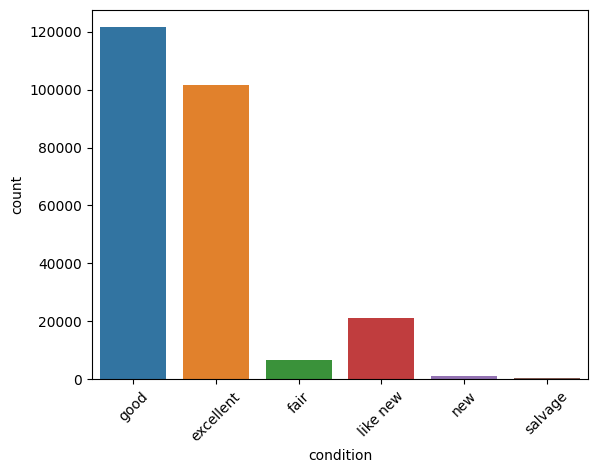
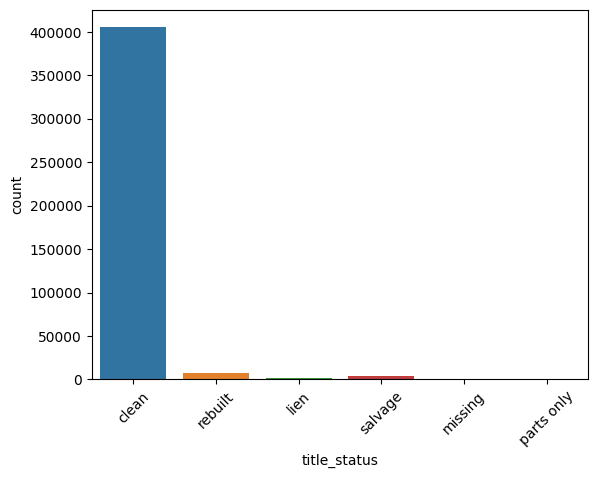
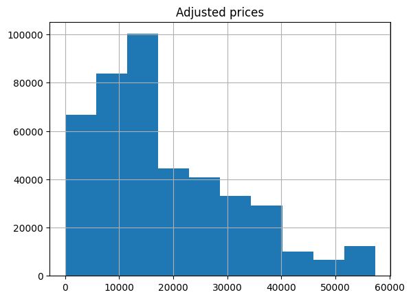
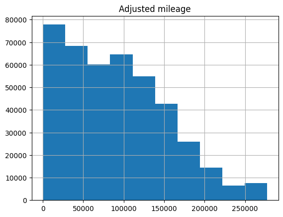
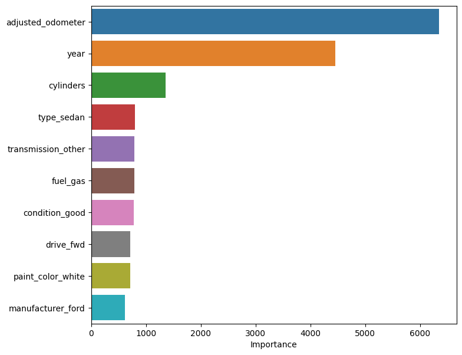

## Practical Application Assignment 11.1: What Drives the Price of a Car?

This project was created as part of an online assignment for UC Berkeley's [Professional Certificate in ML &amp; AI](https://em-executive.berkeley.edu/professional-certificate-machine-learning-artificial-intelligence?advocate_program=01t2s000000ZqNbAAK&advocate_source=dashboard&coupon=IXFD6%3A11-8KE65G8&utm_campaign=incentivized_referrals&utm_content=SO+-+Berkeley+Professional+Certificate+in+ML+%26+AI&utm_medium=personal_url&utm_placement=dashboard&utm_source=referral&utm_term=U4i1l80W3GTaStzCNlN16AsmRVmMs3322wkrdiFJJXDjWY2Kl%2FSmYByqk28Z1wpPBt57rCVH9fEKu%2Bj%2B%2B2MnNXlRmW48YqIE%2Ff68xD%2BvB2eWYj%2BrPjaTIMN4--cMEm5pJ85sMlQO6a--ybrOaW%2FFOItWpgIey12Duw%3D%3D#referrals-email-capture-modal).

### Context and objectives

The used car market is one of the largest in the world. Used cars are in high demand because they are typically sold at discounted prices while remaining usable. As a rule, the sale price of a used car depends on its age and mileage. However, there may be other factors that affect the price.

In this exercise, a used car dealership wishes to develop a model using the [CRISP-DM](https://en.wikipedia.org/wiki/Cross-industry_standard_process_for_data_mining) methodology to analyze used car sales. Such a model can be used to identify important features that affect the price of a used car, and predict prices accordingly. In some cases, the business may be able to take action to increase a car's value. For example, if red cars tend to sell for more, then the dealer could repaint a car to get better offers from potential buyers.

### Data

The data set contains 17 features:

* `id` - the sale ID
* `region` - the region in which the sale took place
* `price` - the sale price. **Target variable**
* `year` - assumed to be model year
* `manufacturer` - the brand
* `model` - a brief description of the vehicle
* `condition` - the vehicle's condition
* `cylinders` - the number of cylinders in the engine
* `fuel` - the vehicle's power source
* `odometer` - the car's mileage, assumed to be miles based on the locations in the data set
* `title_status` - the branded title
* `VIN` - vehicle identification number
* `drive` - drive wheel type
* `size` - vehicle size class
* `type` - the vehicle type
* `paint_color` - the color of the automotive paint
* `state` - the state where the vehicle was sold

### Data cleaning

Because the data had many outliers and missing values, a number of changes were needed to make it suitable for regression:

* Obviously bad data was replaced with median values
* Legitimate values were clipped based on the IQR rule
* In ambiguous situations, observations that may or may not be legitimate were given the benefit of the doubt
* Finally, missing values were replaced with the median for continuous variables and mode for discrete variables

For some columns, research into industry trends was required to determine the best course of action

### Model selection and evaluation

Four regression models were tested in this study:

* Ridge regression
* Lasso regression
* Histogram-based gradient-boosting trees
* LightGBM

Based on the mean squared error, LightGBM had the best predictive performance. We then used hyperparameter tuning and *k*-fold cross-validation to further optimize the model. The final model is then presented as a candidate for production use.

### Findings

Some of our findings from the results include:

* Used car dealers should focus on acquisition of cars with low mileage as those tend to be worth more
  * Older cars are naturally expected to have higher mileage and sell for less
* Other attributes that increase a car's value include:
  * Having more cylinders
  * Is a sedan
  * Good condition
  * Uses gasoline as fuel
  * Ford make

#### Additional information that can be collected to gain better insights

It may be useful to collect additional data that could be used in future models:

* Whether or not the vehicle was involved in any accidents. In many cases, dealerships are legally required to disclose this information
* The price at which the dealer bought the car from the original owner. This information can be used to identify sales with a high profit martin
* A categorical variable indicating the reason the original owner sold the car to the dealership
* The buyer's income. Individuals with lower incomes may try to negotiate a reduced price 

#### Sample visualizations

* Count plot of car condition

* Count plot of title status

* Distribution of adjusted price

* Distribution of adjusted mileage

* Feature importance

### Usage

Please see the [Google Colab tutorial](https://colab.research.google.com/drive/16pBJQePbqkz3QFV54L4NIkOn1kwpuRrj) for information on using Jupyter Notebooks.